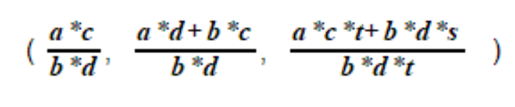

# The Rational Range

----

## the rational milieu

A rational value has two integer-valued components, the numerator and the denominator. Usually, arithmetic with rational values is applied with two values.  Sometimes, as with `muladd`, calculation proceeds with three rational values.  Here are `*`, `+` and `muladd` using rational values.

-----

|      the series formulation         |
|:-----------------------------------:|
|     |
