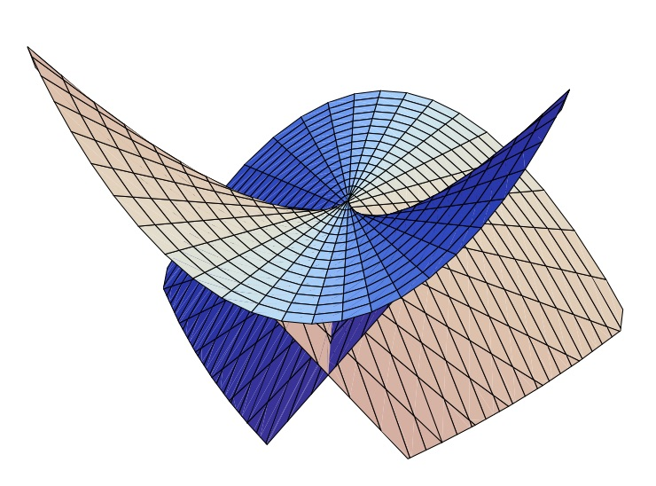

## How to slow FastRationals 

It is demonstrated that `FastRationals` are designed for use with rational values where both numerator and denominator
are of relatively small magnitude.  We find that their performance strengthens with additional use and more terms ..
right up to reaching the critical region of a `swallow tail` where the magnitudes engender unreduced overflow too often.

| Swallow Tail                            |
|-----------------------------------------|
|  |
| this image appears courtesy of [Goo Ishikawa](https://www2.sci.hokudai.ac.jp/faculty/en/researcher/goo-ishikawa) |

----

### what is demonstrated

_The sequences and indicies appearing in this section were obtained by running the source text that follows._

- `FastRational{Int32}` most outperforms `Rational{Int32}` at index __6__ (10x).
  - this is the largest index for which `mayoverflow(_,_) == false`.
  
```
!mayoverflow(sum(fastq32_seqs[5]), fastq32_seqs[6][end]) &&
 mayoverflow(sum(fastq32_seqs[6]), fastq32_seqs[7][end])    === true
```

- `FastRational{Int64}` most outperforms `Rational{Int64}` at index __8__ (12x).
  - this is the largest index for which `mayoverflow(_,_) == false`.

```
!mayoverflow(sum(fastq64_seqs[5]), fastq64_seqs[6][end]) &&
 mayoverflow(sum(fastq64_seqs[6]), fastq64_seqs[7][end])    === true
```

-----

### demonstration

```
using FastRationals, BenchmarkTools, MacroTools, Plots


BenchmarkTools.DEFAULT_PARAMETERS.evals = 1;
BenchmarkTools.DEFAULT_PARAMETERS.overhead = BenchmarkTools.estimate_overhead();
BenchmarkTools.DEFAULT_PARAMETERS.time_tolerance = 2.0e-6;
BenchmarkTools.DEFAULT_PARAMETERS.samples = 200;
BenchmarkTools.DEFAULT_PARAMETERS.seconds = 3;


walk(x, inner, outer) = outer(x)
walk(x::Expr, inner, outer) = outer(Expr(x.head, map(inner, x.args)...))
postwalk(f, x) = walk(x, x -> postwalk(f, x), f)

function referred(expr::Expr)
    if expr.head == :$
        :($(Expr(:$, :(Ref($(expr.args...)))))[])
    else
        expr
    end
end
referred(x) = x

macro noelide(expr)
    out = postwalk(referred, expr) |> esc
end


# using the Int64 Rational types

nterms = 20;     # first 2 terms are (1//1), add one at the end 
rational_terms = [1//factorial(i) for i=1:nterms]; 
fastq64_terms  = FastRational{Int64}.(rational_terms);

# we want successively longer sequences so we can chart computational behavior
rational_seqs = [];
fastq64_seqs  = [];
for i in 1:nterms
     global rational_terms, fastq64terms, rational_seqs, fastq64_seqs
     push!(rational_seqs, rational_terms[1:i])
     push!(fastq64_seqs, fastq64_terms[1:i])
end;

# we time the summations so we can chart relative performance
rational_times = [];
fastq64_times  = [];
for i in 1:nterms
     global rational_seqs, fastq64_seqs, rational_times, fastq64_times
     rseq = rational_seqs[i]
     fseq = fastq64_seqs[i]
     rationaltime = @noelide @belapsed sum($rseq)
     fastq64time  = @noelide @belapsed sum($fseq)
     push!(rational_times, rationaltime)
     push!(fastq64_times, fastq64time)
end;

rational_to_fast64 = Float32.(rational_times ./ fastq64_times);


# using the Int32 Rational types

nterms = 12;     # first 2 terms are (1//1), add one at the end 
rational_terms = Rational{Int32}.([1//factorial(i) for i=1:nterms]); 
fastq32_terms  = FastRational{Int32}.(rational_terms);

# we want successively longer sequences so we can chart computational behavior
rational_seqs = [];
fastq32_seqs  = [];
for i in 1:nterms
     global rational_terms, fastq32_terms, rational_seqs, fastq32_seqs
     push!(rational_seqs, rational_terms[1:i])
     push!(fastq32_seqs, fastq32_terms[1:i])
end;

# we time the summations so we can chart relative performance
rational_times = [];
fastq32_times  = [];
for i in 1:nterms
     global rational_seqs, fastq32_seqs, rational_times, fastq32_times
     rseq = rational_seqs[i]
     fseq = fastq32_seqs[i]
     rationaltime = @noelide @belapsed sum($rseq)
     fastq32time  = @noelide @belapsed sum($fseq)
     push!(rational_times, rationaltime)
     push!(fastq32_times, fastq32time)
end;

rational_to_fast32 = Float32.(rational_times ./ fastq32_times);

# isolate each maximum

len64 = length(rational_to_fast64);
len32 = length(rational_to_fast32);
idxofmax_fastq64 = (1:len64)[maximum(rational_to_fast64) .== rational_to_fast64];
idxofmax_fastq32 = (1:len32)[maximum(rational_to_fast32) .== rational_to_fast32];

# plot

plot(rational_to_fast64, size=(600,600))
plot(rational_to_fast32, size=(600,600))

# also use log plots

log_rational_to_fast64 = log.(rational_to_fast64);
log_rational_to_fast32 = [log.(rational_to_fast32)...,  log_rational_to_fast64[(end-(len64-len32)+1):end]...,];
 
plot(log_rational_to_fast64, size=(600,600))
plot!(log_rational_to_fast32)


println("\nThe maximum relative advantage of FastQ32 occured at index $idxofmax_fastq32\n")
println("\nThe maximum relative advantage of FastQ64 occured at index $idxofmax_fastq64\n")

```
