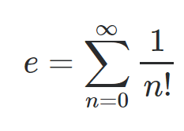

# rational magnitude in action

This page delves deeper into the operational character of this current implementation for FastRationals.

We use the leading terms of this series as an investigative tool, a metaphorical flashlight that works.

|      the series formulation         |                                                              |
|:-----------------------------------:|:-------------------------------------------------------------|
|     |   the source code [here](https://github.com/JeffreySarnoff/FastRationals.jl/blob/master/docs/src/metaphoricalflashlight.md) paints an informative picture.  |

